# Flowchart — KPI Kepegawaian

Dokumen ini berisi diagram alur sistem dan alur penggunaan aplikasi
KPI Kepegawaian menggunakan format Mermaid.

---

## Daftar Isi

1. [Flowchart Sistem (High Level)](#1-flowchart-sistem-high-level)
2. [Alur Autentikasi](#2-alur-autentikasi)
3. [Alur Otorisasi (RBAC + Scope)](#3-alur-otorisasi-rbac--scope)
4. [Alur Manajemen Karyawan](#4-alur-manajemen-karyawan)
5. [Alur Status Karyawan](#5-alur-status-karyawan)
6. [Alur Penilaian Kinerja](#6-alur-penilaian-kinerja)
7. [Alur Periode Penilaian](#7-alur-periode-penilaian)
8. [Alur Catatan Masalah (Incident)](#8-alur-catatan-masalah-incident)
9. [Alur Laporan dan Ekspor](#9-alur-laporan-dan-ekspor)
10. [Alur Impersonasi](#10-alur-impersonasi)
11. [Alur Notifikasi](#11-alur-notifikasi)
12. [Flow Penggunaan per Role](#12-flow-penggunaan-per-role)

---

## 1. Flowchart Sistem (High Level)

Gambaran arsitektur dan alur request secara keseluruhan.

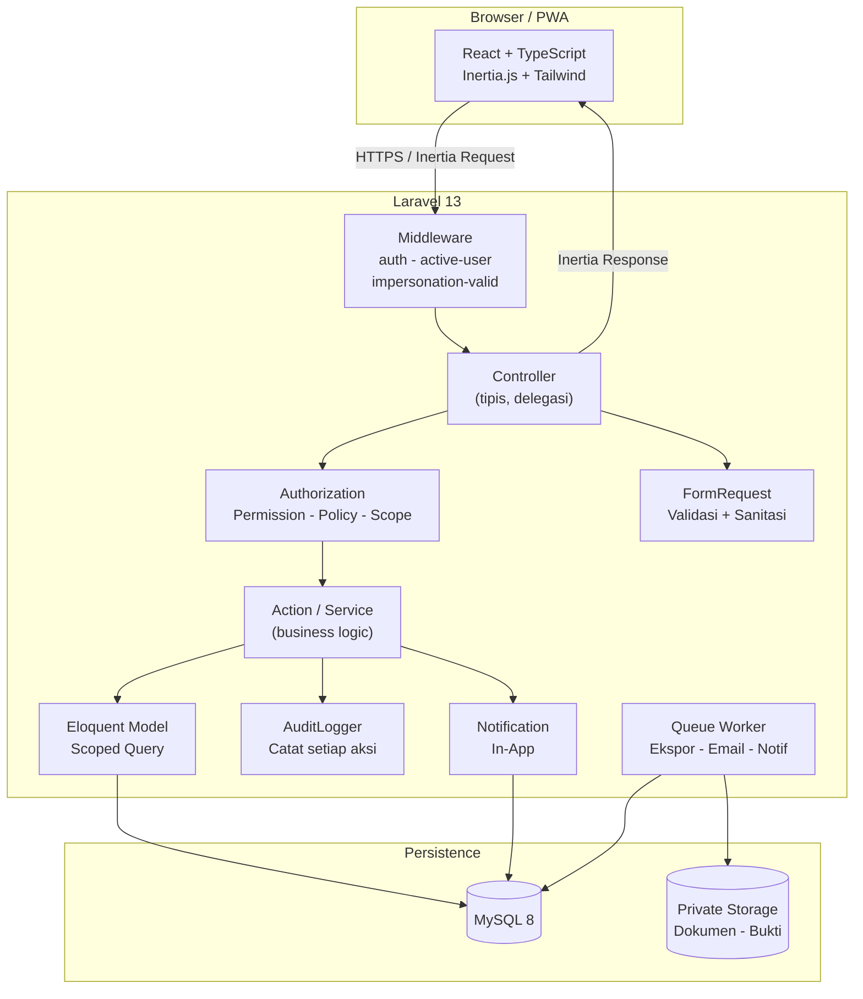
```mermaid
flowchart TB
    subgraph Client["Browser / PWA"]
        UI["React + TypeScript\nInertia.js + Tailwind"]
    end

    subgraph Server["Laravel 13"]
        MW["Middleware\nauth - active-user\nimpersonation-valid"]
        CTRL["Controller\n(tipis, delegasi)"]
        AUTH_LAYER["Authorization\nPermission - Policy - Scope"]
        ACTION["Action / Service\n(business logic)"]
        VALID["FormRequest\nValidasi + Sanitasi"]
        MODEL["Eloquent Model\nScoped Query"]
        AUDIT["AuditLogger\nCatat setiap aksi"]
        NOTIF["Notification\nIn-App"]
        QUEUE["Queue Worker\nEkspor - Email - Notif"]
    end

    subgraph Data["Persistence"]
        DB[("MySQL 8")]
        STORAGE[("Private Storage\nDokumen - Bukti")]
    end

    UI -->|HTTPS / Inertia Request| MW
    MW --> CTRL
    CTRL --> VALID
    CTRL --> AUTH_LAYER
    AUTH_LAYER --> ACTION
    ACTION --> MODEL
    ACTION --> AUDIT
    ACTION --> NOTIF
    MODEL --> DB
    NOTIF --> DB
    QUEUE --> DB
    QUEUE --> STORAGE
    CTRL -->|Inertia Response| UI
```

---

## 2. Alur Autentikasi

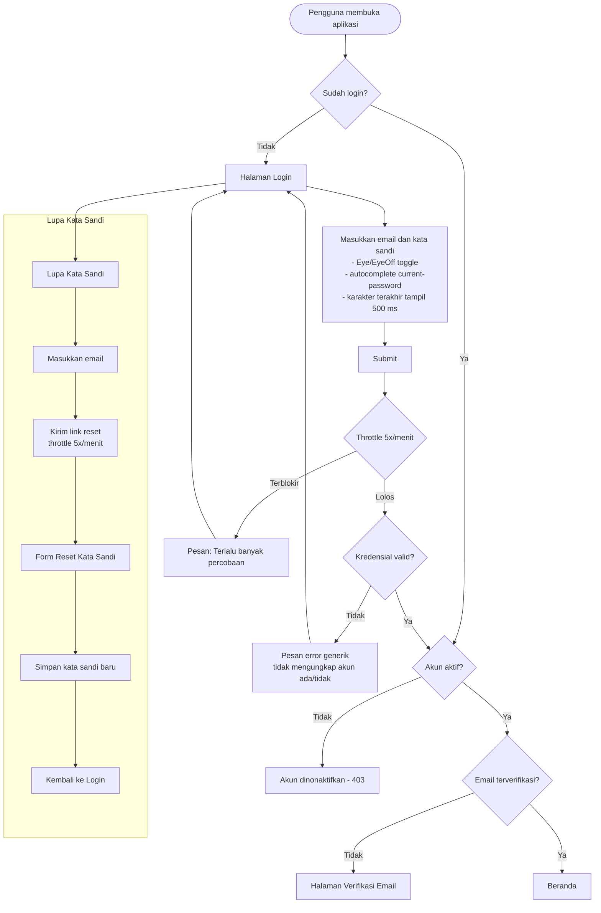
```mermaid
flowchart TD
    START(["Pengguna membuka aplikasi"]) --> CHECK{"Sudah login?"}
    CHECK -->|Ya| ACTIVE{"Akun aktif?"}
    CHECK -->|Tidak| LOGIN["Halaman Login"]

    LOGIN --> INPUT["Masukkan email dan kata sandi\n- Eye/EyeOff toggle\n- autocomplete current-password\n- karakter terakhir tampil 500 ms"]
    INPUT --> SUBMIT["Submit"]
    SUBMIT --> THROTTLE{"Throttle 5x/menit"}
    THROTTLE -->|Terblokir| RATE_ERR["Pesan: Terlalu banyak percobaan"]
    RATE_ERR --> LOGIN
    THROTTLE -->|Lolos| VERIFY{"Kredensial valid?"}
    VERIFY -->|Tidak| LOGIN_ERR["Pesan error generik\ntidak mengungkap akun ada/tidak"]
    LOGIN_ERR --> LOGIN
    VERIFY -->|Ya| ACTIVE

    ACTIVE -->|Tidak| INACTIVE_ERR["Akun dinonaktifkan - 403"]
    ACTIVE -->|Ya| VERIFIED{"Email terverifikasi?"}
    VERIFIED -->|Tidak| VERIFY_EMAIL["Halaman Verifikasi Email"]
    VERIFIED -->|Ya| DASHBOARD["Beranda"]

    subgraph Lupa_Kata_Sandi["Lupa Kata Sandi"]
        FORGOT["Lupa Kata Sandi"] --> REQ_LINK["Masukkan email"]
        REQ_LINK --> SEND_LINK["Kirim link reset\nthrottle 5x/menit"]
        SEND_LINK --> RESET_FORM["Form Reset Kata Sandi"]
        RESET_FORM --> NEW_PASS["Simpan kata sandi baru"]
        NEW_PASS --> BACK_LOGIN["Kembali ke Login"]
    end

    LOGIN --> FORGOT
```

---

## 3. Alur Otorisasi (RBAC + Scope)

Setiap request sensitif melewati pipeline berikut.

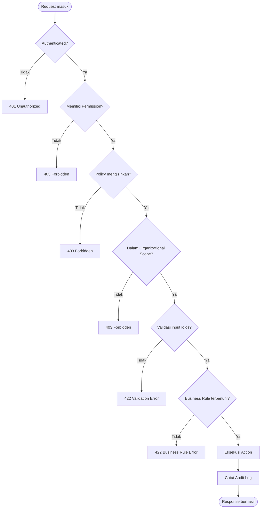
```mermaid
flowchart TD
    REQ(["Request masuk"]) --> AUTH{"Authenticated?"}
    AUTH -->|Tidak| R401["401 Unauthorized"]
    AUTH -->|Ya| PERM{"Memiliki Permission?"}
    PERM -->|Tidak| R403A["403 Forbidden"]
    PERM -->|Ya| POLICY{"Policy mengizinkan?"}
    POLICY -->|Tidak| R403B["403 Forbidden"]
    POLICY -->|Ya| SCOPE{"Dalam Organizational Scope?"}
    SCOPE -->|Tidak| R403C["403 Forbidden"]
    SCOPE -->|Ya| VALIDATE{"Validasi input lolos?"}
    VALIDATE -->|Tidak| R422["422 Validation Error"]
    VALIDATE -->|Ya| BIZ{"Business Rule terpenuhi?"}
    BIZ -->|Tidak| R422B["422 Business Rule Error"]
    BIZ -->|Ya| EXEC["Eksekusi Action"]
    EXEC --> AUDIT_LOG["Catat Audit Log"]
    AUDIT_LOG --> RESPONSE(["Response berhasil"])
```

**Scope per Role:**

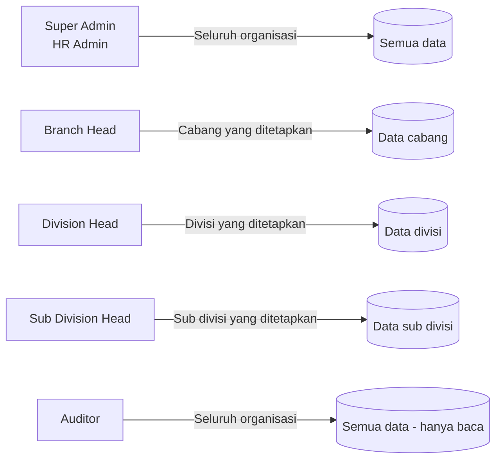
```mermaid
flowchart LR
    SA["Super Admin\nHR Admin"] -->|Seluruh organisasi| ALL[("Semua data")]
    BH["Branch Head"] -->|Cabang yang ditetapkan| BRANCH[("Data cabang")]
    DH["Division Head"] -->|Divisi yang ditetapkan| DIV[("Data divisi")]
    SDH["Sub Division Head"] -->|Sub divisi yang ditetapkan| SUBDIV[("Data sub divisi")]
    AUD["Auditor"] -->|Seluruh organisasi| ALL_RO[("Semua data - hanya baca")]
```

---

## 4. Alur Manajemen Karyawan

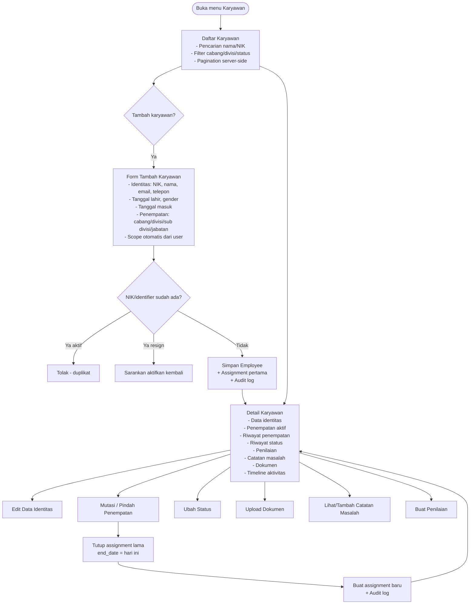
```mermaid
flowchart TD
    START(["Buka menu Karyawan"]) --> LIST["Daftar Karyawan\n- Pencarian nama/NIK\n- Filter cabang/divisi/status\n- Pagination server-side"]

    LIST --> CREATE{"Tambah karyawan?"}
    CREATE -->|Ya| FORM_CREATE["Form Tambah Karyawan\n- Identitas: NIK, nama, email, telepon\n- Tanggal lahir, gender\n- Tanggal masuk\n- Penempatan: cabang/divisi/sub divisi/jabatan\n- Scope otomatis dari user"]
    FORM_CREATE --> CHECK_DUP{"NIK/identifier sudah ada?"}
    CHECK_DUP -->|Ya aktif| DUP_ERR["Tolak - duplikat"]
    CHECK_DUP -->|Ya resign| REHIRE_SUGGEST["Sarankan aktifkan kembali"]
    CHECK_DUP -->|Tidak| SAVE_EMP["Simpan Employee\n+ Assignment pertama\n+ Audit log"]
    SAVE_EMP --> DETAIL

    LIST --> DETAIL["Detail Karyawan\n- Data identitas\n- Penempatan aktif\n- Riwayat penempatan\n- Riwayat status\n- Penilaian\n- Catatan masalah\n- Dokumen\n- Timeline aktivitas"]

    DETAIL --> EDIT["Edit Data Identitas"]
    DETAIL --> TRANSFER["Mutasi / Pindah Penempatan"]
    DETAIL --> STATUS_CHANGE["Ubah Status"]
    DETAIL --> UPLOAD_DOC["Upload Dokumen"]
    DETAIL --> VIEW_INCIDENT["Lihat/Tambah Catatan Masalah"]
    DETAIL --> EVALUATE["Buat Penilaian"]

    TRANSFER --> CLOSE_OLD["Tutup assignment lama\nend_date = hari ini"] --> NEW_ASSIGN["Buat assignment baru\n+ Audit log"]
    NEW_ASSIGN --> DETAIL
```

---

## 5. Alur Status Karyawan

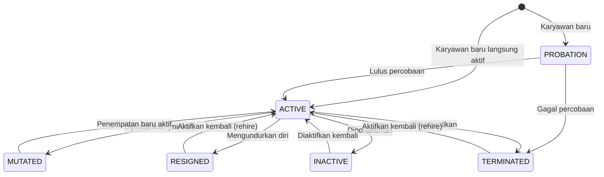
```mermaid
stateDiagram-v2
    [*] --> PROBATION : Karyawan baru
    [*] --> ACTIVE : Karyawan baru langsung aktif

    PROBATION --> ACTIVE : Lulus percobaan
    PROBATION --> TERMINATED : Gagal percobaan

    ACTIVE --> MUTATED : Dipindahkan (mutasi)
    ACTIVE --> RESIGNED : Mengundurkan diri
    ACTIVE --> TERMINATED : Diberhentikan
    ACTIVE --> INACTIVE : Dinonaktifkan

    MUTATED --> ACTIVE : Penempatan baru aktif

    RESIGNED --> ACTIVE : Aktifkan kembali (rehire)
    TERMINATED --> ACTIVE : Aktifkan kembali (rehire)
    INACTIVE --> ACTIVE : Diaktifkan kembali
```

> **Catatan:** Histori TIDAK dihapus saat resign/terminasi. Identitas tetap
> permanen. Rehire menghubungkan ke identitas lama.

---

## 6. Alur Penilaian Kinerja

### Workflow Status Penilaian

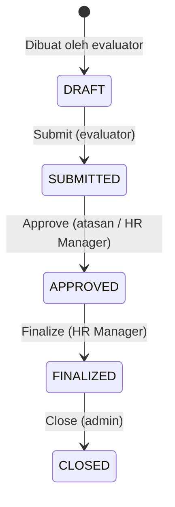
```mermaid
stateDiagram-v2
    [*] --> DRAFT : Dibuat oleh evaluator

    DRAFT --> SUBMITTED : Submit (evaluator)
    SUBMITTED --> APPROVED : Approve (atasan / HR Manager)
    APPROVED --> FINALIZED : Finalize (HR Manager)
    FINALIZED --> CLOSED : Close (admin)
```

- **DRAFT** — boleh diperbarui, score dihitung ulang otomatis oleh backend.
- **FINALIZED** — read-only, snapshot weight dan score tersimpan permanen.

### Proses Penilaian Detail

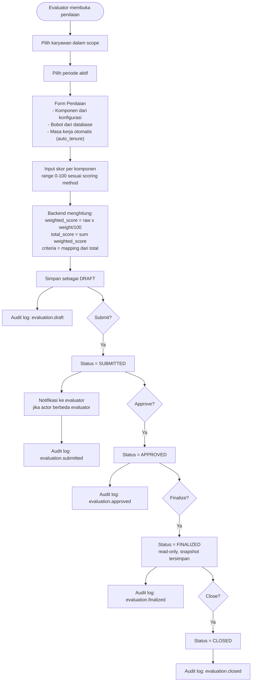
```mermaid
flowchart TD
    START(["Evaluator membuka penilaian"]) --> SELECT_EMP["Pilih karyawan dalam scope"]
    SELECT_EMP --> SELECT_PERIOD["Pilih periode aktif"]
    SELECT_PERIOD --> FORM["Form Penilaian\n- Komponen dari konfigurasi\n- Bobot dari database\n- Masa kerja otomatis (auto_tenure)"]

    FORM --> INPUT_SCORE["Input skor per komponen\nrange 0-100 sesuai scoring method"]
    INPUT_SCORE --> CALC["Backend menghitung:\nweighted_score = raw x weight/100\ntotal_score = sum weighted_score\ncriteria = mapping dari total"]
    CALC --> SAVE_DRAFT["Simpan sebagai DRAFT"]
    SAVE_DRAFT --> AUDIT1["Audit log: evaluation.draft"]

    SAVE_DRAFT --> SUBMIT{"Submit?"}
    SUBMIT -->|Ya| STATUS_SUBMIT["Status = SUBMITTED"]
    STATUS_SUBMIT --> NOTIFY_EVAL["Notifikasi ke evaluator\njika actor berbeda evaluator"]
    NOTIFY_EVAL --> AUDIT2["Audit log: evaluation.submitted"]

    STATUS_SUBMIT --> APPROVE{"Approve?"}
    APPROVE -->|Ya| STATUS_APPROVE["Status = APPROVED"]
    STATUS_APPROVE --> AUDIT3["Audit log: evaluation.approved"]

    STATUS_APPROVE --> FINALIZE{"Finalize?"}
    FINALIZE -->|Ya| STATUS_FINAL["Status = FINALIZED\nread-only, snapshot tersimpan"]
    STATUS_FINAL --> AUDIT4["Audit log: evaluation.finalized"]

    STATUS_FINAL --> CLOSE{"Close?"}
    CLOSE -->|Ya| STATUS_CLOSED["Status = CLOSED"]
    STATUS_CLOSED --> AUDIT5["Audit log: evaluation.closed"]
```

---

## 7. Alur Periode Penilaian

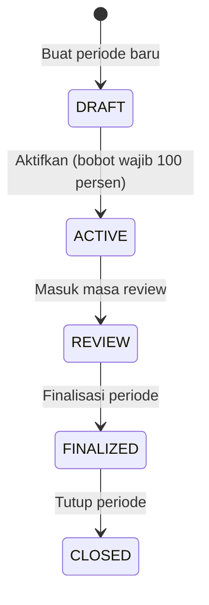
```mermaid
stateDiagram-v2
    [*] --> DRAFT : Buat periode baru

    DRAFT --> ACTIVE : Aktifkan (bobot wajib 100 persen)
    ACTIVE --> REVIEW : Masuk masa review
    REVIEW --> FINALIZED : Finalisasi periode
    FINALIZED --> CLOSED : Tutup periode
```

- **DRAFT** — nama, tanggal mulai, dan tanggal akhir dapat diedit.
- **ACTIVE** — total bobot komponen aktif harus tepat 100% sebelum periode
  dapat diaktifkan.

---

## 8. Alur Catatan Masalah (Incident)

### Status Lifecycle

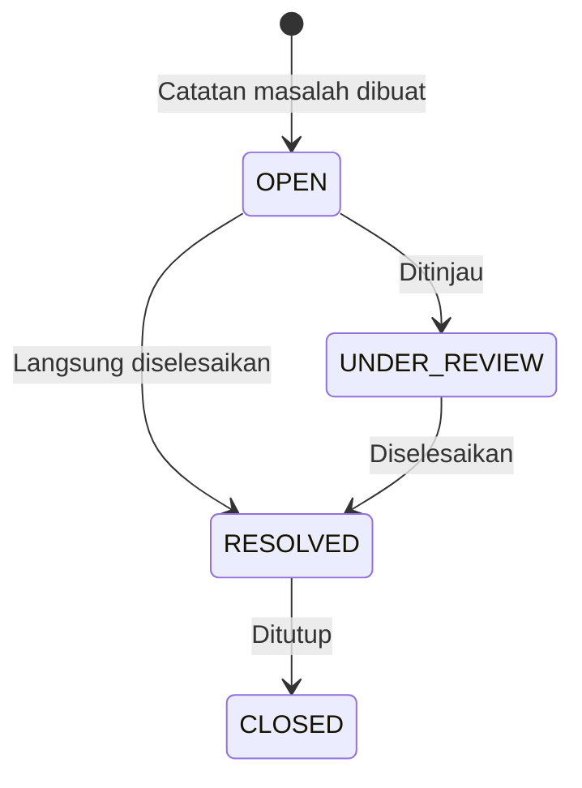
```mermaid
stateDiagram-v2
    [*] --> OPEN : Catatan masalah dibuat

    OPEN --> UNDER_REVIEW : Ditinjau
    OPEN --> RESOLVED : Langsung diselesaikan

    UNDER_REVIEW --> RESOLVED : Diselesaikan

    RESOLVED --> CLOSED : Ditutup
```

- **OPEN** — severity: LOW / MEDIUM / HIGH / CRITICAL. HIGH/CRITICAL memicu
  notifikasi otomatis ke user dengan permission resolve.
- **RESOLVED** — wajib mengisi resolusi. Dicatat: resolver, waktu, audit log.

### Proses Pencatatan Masalah

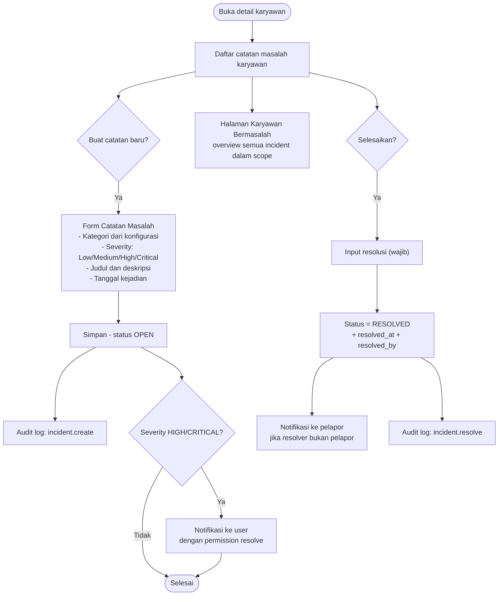
```mermaid
flowchart TD
    START(["Buka detail karyawan"]) --> INCIDENT_LIST["Daftar catatan masalah karyawan"]
    INCIDENT_LIST --> CREATE{"Buat catatan baru?"}
    CREATE -->|Ya| FORM["Form Catatan Masalah\n- Kategori dari konfigurasi\n- Severity: Low/Medium/High/Critical\n- Judul dan deskripsi\n- Tanggal kejadian"]
    FORM --> SAVE["Simpan - status OPEN"]
    SAVE --> AUDIT_INC["Audit log: incident.create"]
    SAVE --> CHECK_SEV{"Severity HIGH/CRITICAL?"}
    CHECK_SEV -->|Ya| NOTIFY_RESOLVE["Notifikasi ke user\ndengan permission resolve"]
    CHECK_SEV -->|Tidak| DONE(["Selesai"])
    NOTIFY_RESOLVE --> DONE

    INCIDENT_LIST --> OVERVIEW["Halaman Karyawan Bermasalah\noverview semua incident dalam scope"]

    INCIDENT_LIST --> RESOLVE{"Selesaikan?"}
    RESOLVE -->|Ya| RESOLUTION["Input resolusi (wajib)"]
    RESOLUTION --> MARK_RESOLVED["Status = RESOLVED\n+ resolved_at + resolved_by"]
    MARK_RESOLVED --> NOTIFY_REPORTER["Notifikasi ke pelapor\njika resolver bukan pelapor"]
    MARK_RESOLVED --> AUDIT_RESOLVE["Audit log: incident.resolve"]
```

---

## 9. Alur Laporan dan Ekspor

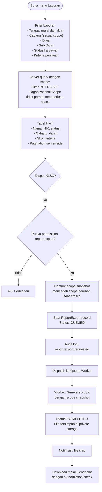
```mermaid
flowchart TD
    START(["Buka menu Laporan"]) --> FILTER["Filter Laporan\n- Tanggal mulai dan akhir\n- Cabang (sesuai scope)\n- Divisi\n- Sub Divisi\n- Status karyawan\n- Kriteria penilaian"]
    FILTER --> QUERY["Server query dengan scope:\nFilter INTERSECT Organizational Scope\ntidak pernah memperluas akses"]
    QUERY --> TABLE["Tabel Hasil\n- Nama, NIK, status\n- Cabang, divisi\n- Skor, kriteria\n- Pagination server-side"]

    TABLE --> EXPORT{"Ekspor XLSX?"}
    EXPORT -->|Ya| CHECK_PERM{"Punya permission report.export?"}
    CHECK_PERM -->|Tidak| DENIED["403 Forbidden"]
    CHECK_PERM -->|Ya| SNAPSHOT["Capture scope snapshot\nmencegah scope berubah saat proses"]
    SNAPSHOT --> CREATE_JOB["Buat ReportExport record\nStatus: QUEUED"]
    CREATE_JOB --> AUDIT_EXP["Audit log: report.export.requested"]
    AUDIT_EXP --> DISPATCH["Dispatch ke Queue Worker"]
    DISPATCH --> GENERATE["Worker: Generate XLSX\ndengan scope snapshot"]
    GENERATE --> READY["Status: COMPLETED\nFile tersimpan di private storage"]
    READY --> NOTIFY_USER["Notifikasi: file siap"]
    NOTIFY_USER --> DOWNLOAD["Download melalui endpoint\ndengan authorization check"]
```

---

## 10. Alur Impersonasi

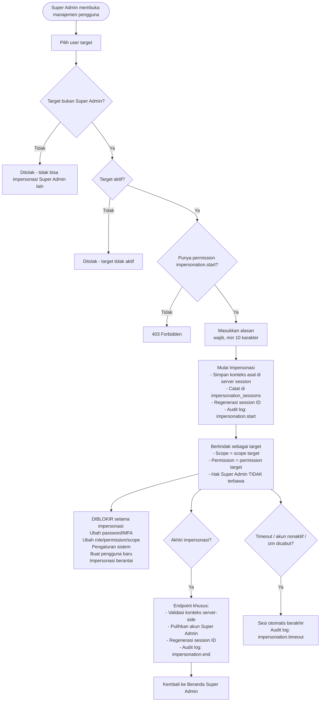
```mermaid
flowchart TD
    START(["Super Admin membuka manajemen pengguna"]) --> SELECT["Pilih user target"]
    SELECT --> CHECK_ROLE{"Target bukan Super Admin?"}
    CHECK_ROLE -->|Tidak| DENIED1["Ditolak - tidak bisa impersonasi Super Admin lain"]
    CHECK_ROLE -->|Ya| CHECK_ACTIVE{"Target aktif?"}
    CHECK_ACTIVE -->|Tidak| DENIED2["Ditolak - target tidak aktif"]
    CHECK_ACTIVE -->|Ya| CHECK_PERM{"Punya permission impersonation.start?"}
    CHECK_PERM -->|Tidak| DENIED3["403 Forbidden"]
    CHECK_PERM -->|Ya| INPUT_REASON["Masukkan alasan\nwajib, min 10 karakter"]
    INPUT_REASON --> START_IMP["Mulai Impersonasi\n- Simpan konteks asal di server session\n- Catat di impersonation_sessions\n- Regenerasi session ID\n- Audit log: impersonation.start"]
    START_IMP --> ACTING["Bertindak sebagai target\n- Scope = scope target\n- Permission = permission target\n- Hak Super Admin TIDAK terbawa"]

    ACTING --> BLOCKED["DIBLOKIR selama impersonasi:\nUbah password/MFA\nUbah role/permission/scope\nPengaturan sistem\nBuat pengguna baru\nImpersonasi berantai"]

    ACTING --> END_IMP{"Akhiri impersonasi?"}
    END_IMP -->|Ya| RESTORE["Endpoint khusus:\n- Validasi konteks server-side\n- Pulihkan akun Super Admin\n- Regenerasi session ID\n- Audit log: impersonation.end"]
    RESTORE --> DASHBOARD["Kembali ke Beranda Super Admin"]

    ACTING --> AUTO_END{"Timeout / akun nonaktif /\nizin dicabut?"}
    AUTO_END -->|Ya| FORCE_END["Sesi otomatis berakhir\nAudit log: impersonation.timeout"]
```

---

## 11. Alur Notifikasi

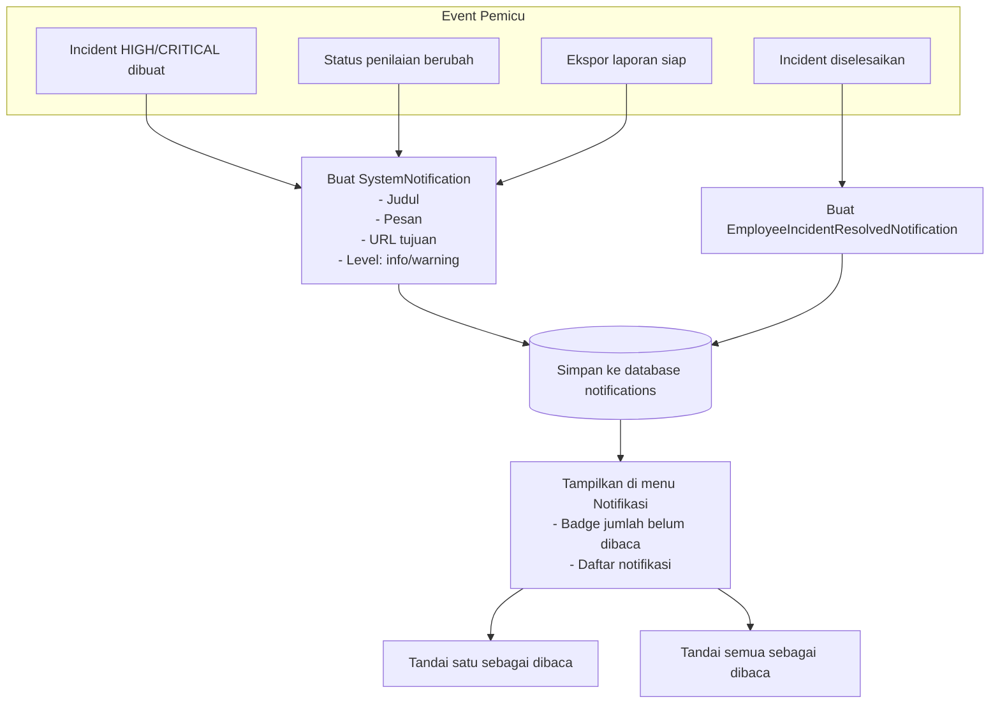
```mermaid
flowchart TD
    subgraph Trigger["Event Pemicu"]
        T1["Incident HIGH/CRITICAL dibuat"]
        T2["Status penilaian berubah"]
        T3["Incident diselesaikan"]
        T4["Ekspor laporan siap"]
    end

    T1 --> CREATE_NOTIF["Buat SystemNotification\n- Judul\n- Pesan\n- URL tujuan\n- Level: info/warning"]
    T2 --> CREATE_NOTIF
    T3 --> CREATE_RESOLVE_NOTIF["Buat EmployeeIncidentResolvedNotification"]
    T4 --> CREATE_NOTIF

    CREATE_NOTIF --> SAVE_DB[("Simpan ke database notifications")]
    CREATE_RESOLVE_NOTIF --> SAVE_DB

    SAVE_DB --> BELL["Tampilkan di menu Notifikasi\n- Badge jumlah belum dibaca\n- Daftar notifikasi"]

    BELL --> READ_ONE["Tandai satu sebagai dibaca"]
    BELL --> READ_ALL["Tandai semua sebagai dibaca"]
```

---

## 12. Flow Penggunaan per Role

### Super Admin

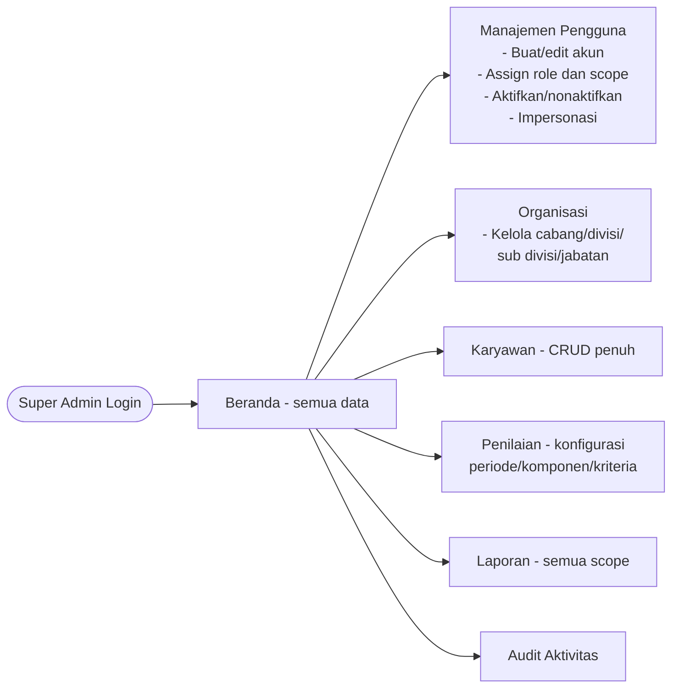
```mermaid
flowchart LR
    SA(["Super Admin Login"]) --> DASH["Beranda - semua data"]
    DASH --> UM["Manajemen Pengguna\n- Buat/edit akun\n- Assign role dan scope\n- Aktifkan/nonaktifkan\n- Impersonasi"]
    DASH --> ORG["Organisasi\n- Kelola cabang/divisi/\nsub divisi/jabatan"]
    DASH --> EMP["Karyawan - CRUD penuh"]
    DASH --> EVAL["Penilaian - konfigurasi\nperiode/komponen/kriteria"]
    DASH --> REPORT["Laporan - semua scope"]
    DASH --> AUDIT["Audit Aktivitas"]
```

### HR Admin

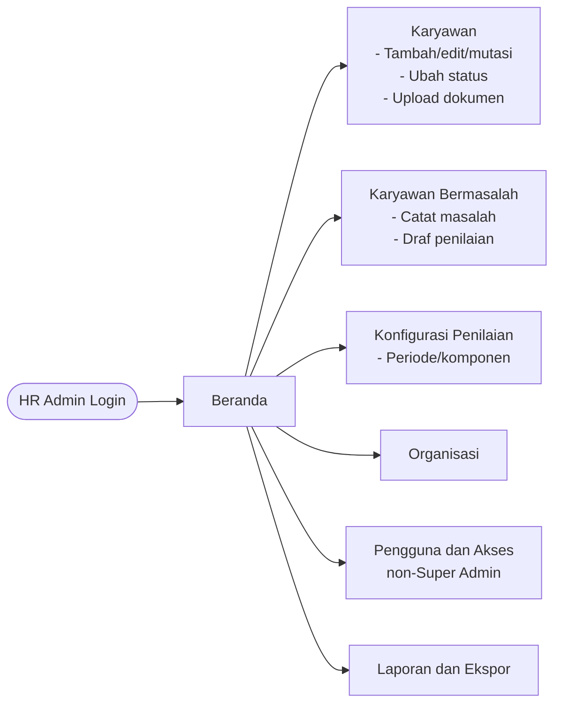
```mermaid
flowchart LR
    HR(["HR Admin Login"]) --> DASH["Beranda"]
    DASH --> EMP["Karyawan\n- Tambah/edit/mutasi\n- Ubah status\n- Upload dokumen"]
    DASH --> INC["Karyawan Bermasalah\n- Catat masalah\n- Draf penilaian"]
    DASH --> EVAL_CFG["Konfigurasi Penilaian\n- Periode/komponen"]
    DASH --> ORG["Organisasi"]
    DASH --> USERS["Pengguna dan Akses\nnon-Super Admin"]
    DASH --> REPORT["Laporan dan Ekspor"]
```

### HR Manager

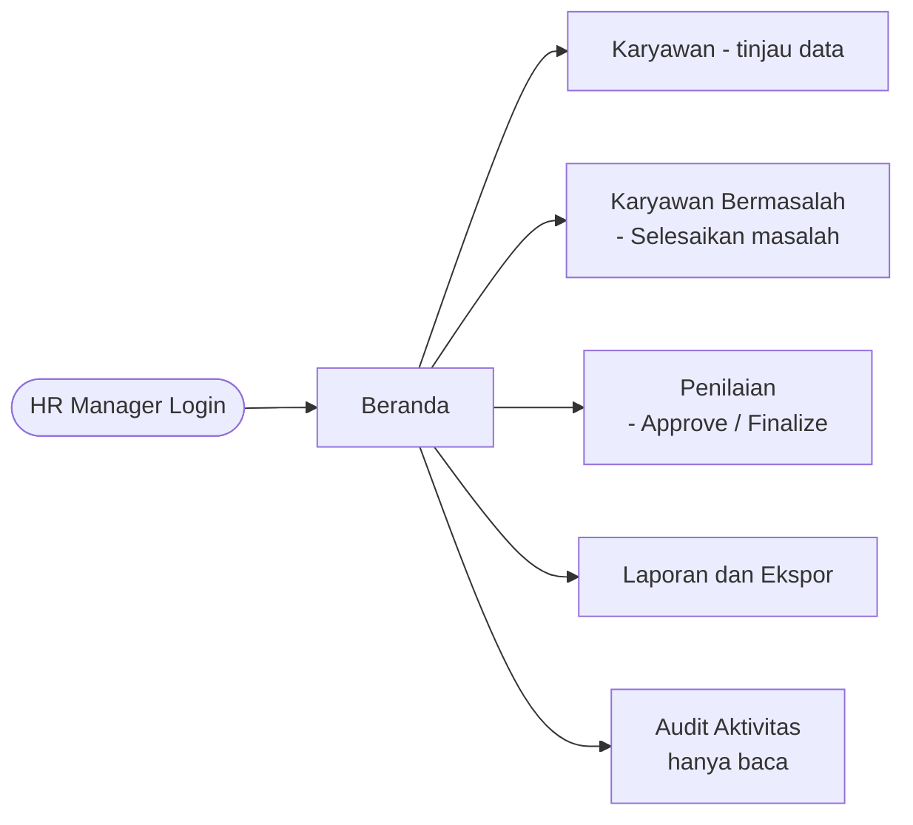
```mermaid
flowchart LR
    HRM(["HR Manager Login"]) --> DASH["Beranda"]
    DASH --> EMP["Karyawan - tinjau data"]
    DASH --> INC["Karyawan Bermasalah\n- Selesaikan masalah"]
    DASH --> EVAL["Penilaian\n- Approve / Finalize"]
    DASH --> REPORT["Laporan dan Ekspor"]
    DASH --> AUDIT["Audit Aktivitas\nhanya baca"]
```

### Branch Head (Kepala Cabang)

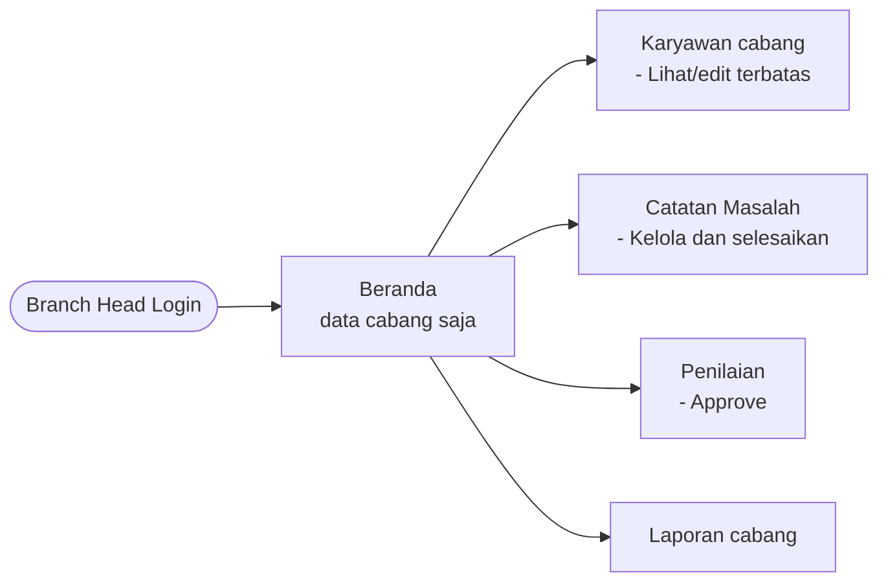
```mermaid
flowchart LR
    BH(["Branch Head Login"]) --> DASH["Beranda\ndata cabang saja"]
    DASH --> EMP["Karyawan cabang\n- Lihat/edit terbatas"]
    DASH --> INC["Catatan Masalah\n- Kelola dan selesaikan"]
    DASH --> EVAL["Penilaian\n- Approve"]
    DASH --> REPORT["Laporan cabang"]
```

### Division Head (Kepala Divisi)

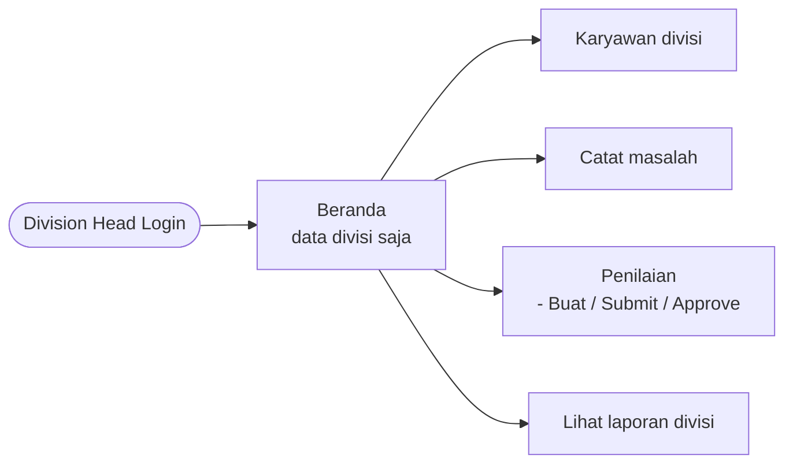
```mermaid
flowchart LR
    DH(["Division Head Login"]) --> DASH["Beranda\ndata divisi saja"]
    DASH --> EMP["Karyawan divisi"]
    DASH --> INC["Catat masalah"]
    DASH --> EVAL["Penilaian\n- Buat / Submit / Approve"]
    DASH --> REPORT["Lihat laporan divisi"]
```

### Sub Division Head (Kepala Sub Divisi)

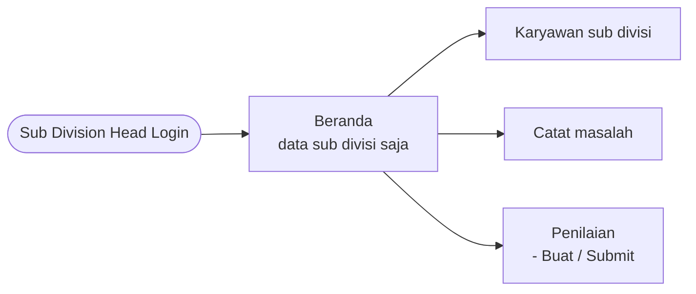
```mermaid
flowchart LR
    SDH(["Sub Division Head Login"]) --> DASH["Beranda\ndata sub divisi saja"]
    DASH --> EMP["Karyawan sub divisi"]
    DASH --> INC["Catat masalah"]
    DASH --> EVAL["Penilaian\n- Buat / Submit"]
```

### Auditor

```mermaid
flowchart LR
    AUD(["Auditor Login"]) --> DASH["Beranda\nsemua data - hanya baca"]
    DASH --> EMP["Karyawan - hanya baca"]
    DASH --> INC["Catatan Masalah - hanya baca"]
    DASH --> EVAL["Penilaian - hanya baca"]
    DASH --> REPORT["Laporan dan Ekspor"]
    DASH --> AUDIT["Audit Aktivitas"]
```

---

## Catatan

- Semua diagram menggunakan format **Mermaid** dan dapat dirender langsung
  di GitHub, GitLab, VS Code (dengan ekstensi), atau Mermaid Live Editor.
- Flowchart ini merupakan representasi dari kode aktual di repository ini.
  Rujukan utama: `routes/web.php`, `routes/auth.php`, `app/Actions/`,
  `app/Http/Controllers/`, `app/Enums/EmployeeStatus.php`, dan
  `BUSINESS_RULES.md`.
- Jika ada perubahan alur bisnis atau status, dokumen ini wajib diperbarui
  sesuai kebijakan di `AGENTS.md` bagian 18.
