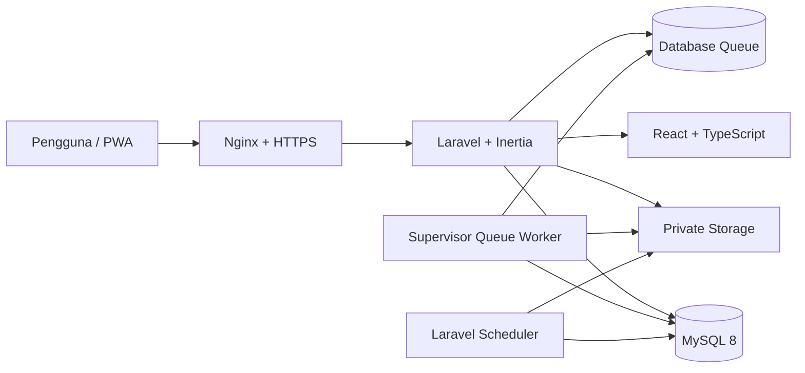

# KPI Kepegawaian

Sistem internal untuk mengelola data karyawan, struktur organisasi, penilaian
kinerja, catatan masalah, dokumen privat, notifikasi, audit aktivitas, dan
laporan periodik. Aplikasi menggunakan Laravel dan React melalui Inertia.js,
dengan otorisasi berbasis role, permission, dan cakupan organisasi.

> Repository ini bersifat privat. Jangan memasukkan `.env`, kredensial,
> database, dokumen karyawan, atau data production ke dalam Git.

## Fitur Utama

- Pengelolaan identitas dan status karyawan tanpa menghapus histori kerja.
- Riwayat penempatan cabang, divisi, sub-divisi, dan jabatan.
- Konfigurasi periode, komponen, bobot, dan kriteria penilaian.
- Alur penilaian dari draf, pengajuan, persetujuan, hingga finalisasi.
- Catatan masalah karyawan beserta status penyelesaiannya.
- Dokumen karyawan yang disimpan secara privat dan diunduh melalui otorisasi.
- Laporan terfilter sesuai scope serta export XLSX melalui queue.
- Notifikasi, audit aktivitas, dan pembersihan export kedaluwarsa terjadwal.
- Manajemen pengguna dan impersonasi yang dibatasi untuk Super Admin.
- PWA dengan cache aset statis tanpa menyimpan data personal atau sesi.

## Role dan Cakupan Akses

| Role | Cakupan umum |
| --- | --- |
| Super Admin | Seluruh organisasi dan pengaturan sistem |
| HR Admin | Pengelolaan SDM sesuai scope yang diberikan |
| HR Manager | Peninjauan, persetujuan, laporan, dan audit yang diizinkan |
| Branch Head | Karyawan pada cabang yang ditetapkan |
| Division Head | Karyawan pada divisi yang ditetapkan |
| Sub Division Head | Karyawan pada sub-divisi yang ditetapkan |
| Auditor | Akses hanya-baca dan export sesuai scope |

Setiap request sensitif diperiksa di backend melalui authentication,
permission, policy, organizational scope, validation, business rule, dan audit.
Menyembunyikan menu di frontend bukan mekanisme otorisasi.

## Teknologi

| Bagian | Teknologi |
| --- | --- |
| Backend | Laravel 13, PHP 8.3+ |
| Frontend | React 18, TypeScript, Inertia.js |
| UI | Tailwind CSS, shadcn/ui, Lucide React |
| Form dan data | React Hook Form, Zod, TanStack Table |
| Grafik dan tanggal | Recharts, date-fns |
| Database | MySQL 8 |
| Hak akses | Spatie Laravel Permission |
| Export | Laravel Excel/XLSX dan database queue |
| Build | Vite 7 |
| Operasional | Nginx, PHP-FPM, Supervisor, Laravel Scheduler |

Seluruh font, icon, JavaScript, dan CSS disediakan dari aplikasi tanpa CDN
runtime.

## Arsitektur Ringkas



Export laporan diproses oleh queue worker. Scheduler menghapus file export yang
sudah kedaluwarsa. Keduanya harus aktif pada server production.

## Persyaratan Lokal

- PHP `8.3` atau lebih baru.
- Composer 2.
- Node.js 22 LTS dan npm.
- MySQL 8.
- Extension PHP: `ctype`, `curl`, `dom`, `fileinfo`, `filter`, `gd`, `intl`,
  `mbstring`, `openssl`, `pdo_mysql`, `session`, `tokenizer`, `xml`, dan `zip`.

## Instalasi Lokal

Clone repository dan masuk ke direktori project:

```bash
git clone https://github.com/rzarxx/KPI-Kepegawaian.git
cd KPI-Kepegawaian
```

Pasang dependency:

```bash
composer install
npm ci
```

Buat environment lokal.

Linux/macOS:

```bash
cp .env.example .env
php artisan key:generate
```

Windows PowerShell:

```powershell
Copy-Item .env.example .env
php artisan key:generate
```

Buat database MySQL kosong, kemudian sesuaikan bagian berikut di `.env`:

```dotenv
APP_ENV=local
APP_DEBUG=true
APP_URL=http://127.0.0.1:8000

DB_CONNECTION=mysql
DB_HOST=127.0.0.1
DB_PORT=3306
DB_DATABASE=kpi_kepegawaian
DB_USERNAME=root
DB_PASSWORD=

QUEUE_CONNECTION=database
DB_QUEUE_RETRY_AFTER=300
```

Jalankan migration dan seeder konfigurasi awal:

```bash
php artisan migrate --seed
```

Seeder utama membuat role, permission, dan konfigurasi domain. Seeder akun UAT
`LocalRoleAccountSeeder` hanya boleh digunakan pada environment `local` atau
`testing` dan tidak boleh dijalankan di production.

## Menjalankan Aplikasi

Linux/macOS:

```bash
composer run dev
```

Windows:

```powershell
composer run dev:windows
```

Aplikasi tersedia di `http://127.0.0.1:8000`. Perintah development tersebut
menjalankan web server, Vite, dan queue listener. Untuk menguji scheduler pada
terminal terpisah:

```bash
php artisan schedule:work
```

Pembuatan akun Super Admin pertama dijelaskan pada
[`PANDUAN_INSTALASI_PRODUCTION.md`](PANDUAN_INSTALASI_PRODUCTION.md#8-membuat-super-admin-pertama).

## Pemeriksaan Kualitas

Jalankan seluruh pemeriksaan sebelum membuat pull request atau deployment:

```bash
php artisan test
php vendor/bin/pint --test
npm run typecheck
npm run lint
npm run build
```

Test backend menggunakan database SQLite in-memory yang terisolasi. Perintah
test tidak boleh diarahkan ke database development atau production.

## Deployment Production

Gunakan panduan lengkap berikut:

- [`PANDUAN_INSTALASI_PRODUCTION.md`](PANDUAN_INSTALASI_PRODUCTION.md) — instalasi
  baru, `.env`, Nginx, Supervisor, scheduler, backup, smoke test, dan checklist
  go-live.
- [`DEPLOYMENT.md`](DEPLOYMENT.md) — referensi deployment ringkas dan prosedur
  update/rollback.

Aturan penting:

- Gunakan `APP_ENV=production` dan `APP_DEBUG=false`.
- Arahkan document root Nginx ke direktori `public`.
- Jalankan migration production dengan `php artisan migrate --force`.
- Jangan menjalankan `migrate:fresh`, `migrate:reset`, atau seeder akun UAT.
- Jangan mengganti `APP_KEY` pada aplikasi yang sudah memiliki data terenkripsi.
- Aktifkan HTTPS, backup database, queue worker, dan cron scheduler.
- Pastikan `DB_QUEUE_RETRY_AFTER=300` lebih besar dari timeout worker `240`
  detik dan timeout job export `180` detik.
- Lakukan smoke test seluruh role dan scope sebelum membuka akses pengguna.

Keberhasilan build dan test lokal adalah prasyarat, bukan bukti bahwa server
production sudah siap. Checklist go-live tetap harus diselesaikan pada server.

## Struktur Project

```text
app/                 Domain, action/service, policy, job, dan HTTP layer
config/              Konfigurasi Laravel dan aplikasi
database/            Migration, factory, dan seeder
public/              Entry point dan aset publik/PWA
resources/js/        React, TypeScript, komponen, layout, dan halaman
routes/              Route web, autentikasi, dan scheduler
storage/app/private/ Dokumen privat; tidak boleh dipublikasikan
tests/                Unit dan feature test
```

## Dokumentasi

| Dokumen | Isi |
| --- | --- |
| [`PANDUAN_INSTALASI_PRODUCTION.md`](PANDUAN_INSTALASI_PRODUCTION.md) | Panduan instalasi production langkah demi langkah |
| [`ARCHITECTURE.md`](ARCHITECTURE.md) | Arsitektur aplikasi |
| [`DATABASE.md`](DATABASE.md) | Struktur dan relasi data |
| [`BUSINESS_RULES.md`](BUSINESS_RULES.md) | Aturan bisnis |
| [`RBAC_MATRIX.md`](RBAC_MATRIX.md) | Matriks role, permission, dan scope |
| [`SECURITY.md`](SECURITY.md) | Baseline keamanan |
| [`SCORING_RULES.md`](SCORING_RULES.md) | Aturan perhitungan penilaian |
| [`REPORTING.md`](REPORTING.md) | Laporan dan export |
| [`PWA.md`](PWA.md) | Strategi PWA dan cache |
| [`TESTING.md`](TESTING.md) | Strategi dan perintah pengujian |
| [`CHANGELOG.md`](CHANGELOG.md) | Riwayat perubahan |

## Alur Perubahan

1. Buat branch dari `main`.
2. Implementasikan perubahan beserta test yang relevan.
3. Perbarui dokumentasi dan `CHANGELOG.md` bila perilaku berubah.
4. Jalankan seluruh pemeriksaan kualitas.
5. Review keamanan, policy, scope organisasi, migration, dan dampak data.
6. Buat pull request ke `main`.

Jangan commit rahasia, data personal karyawan, file database, log, hasil export,
atau dokumen privat.
